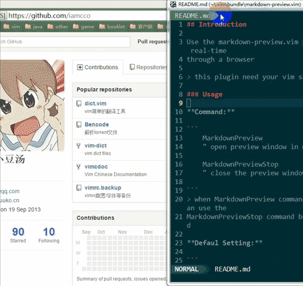

## Introduction

[](https://gitter.im/iamcco/markdown-preview.vim?utm_source=badge&utm_medium=badge&utm_campaign=pr-badge&utm_content=badge)

Use the markdown-preview.vim plugin you can preview markdown on real-time
through a browser

> this plugin need your vim support py2/py3 features  
> test on windows/ubuntu14


### screenshot



### Installation

Using with [Vundle][Vundle]:

put `Plugin 'iamcco/markdown-preview.vim'` to the `.vimrc/_vimrc` file and type
`:PluginInstall`

### Usage

**Command:**

```
    MarkdownPreview
    " open preview window in markdown buffer

    MarkdownPreviewStop
    " close the preview window and server

```
> when MarkdownPreview command can't open preview window, you can use the
MarkdownPreviewStop command before using MarkdownPreview command

**Defaul Setting:**

```
    let g:mkdp_path_to_chrome = "google-chrome"
    " path to the chrome or the command to open chrome(or other modern browsers)

    let g:mkdp_auto_start = 0
    " set to 1, the vim will open the preview window once enter the markdown
    " buffer

    let g:mkdp_auto_open = 0
    " set to 1, the vim will auto open preview window when you edit the
    " markdown file

    let g:mkdp_auto_close = 1
    " set to 1, the vim will auto close current preview window when change
    " from markdown buffer to another buffer

    let g:mkdp_refresh_slow = 0
    " set to 1, the vim will just refresh markdown when save the buffer or
    " leave from insert mode, default 0 is auto refresh markdown as you edit or
    " move the cursor
```

For **OS X** users you can set the `g:mkdp_path_to_chrome` as below (if you use chrome):

```
let g:mkdp_path_to_chrome = "open -a Google\\ Chrome"
" or
let g:mkdp_path_to_chrome = "/Applications/Google\\ Chrome.app/Contents/MacOS/Google\\ Chrome"
```
see issue[#1](https://github.com/iamcco/markdown-preview.vim/issues/1) for detail

### Changelog

* 2016/03/12: new Github like markdown styles [markdown.css](https://github.com/iamcco/markdown.css) and support task list
* 2016/01/24: support display the local picture in markdown

--------------------------------------------------------------------------------

### 说明

使用 markdown-preview.vim 插件可以实时通过浏览器预览 markdown 文件

> 使用该插件需要 vim 支持py2/py3

### 安装

使用 [Vundle][Vundle]:

在 `.vimrc/_vimrc` 配置文件中添加 `Plugin 'iamcco/markdown-preview.vim'` 然后
运行 `:PluginInstall` 命令

### 使用和设置

**命令：**

```
    MarkdownPreview
    " 在打开 markdown 文件后，使用该命令可以打开预览窗口

    MarkdownPreviewStop
    " 关闭 markdown 预览窗口，并停止开启的服务进程

```
> 在 MarkdownPreview 命令无效的情况下，可以先 MarkdownPreviewStop 再 MarkdownPreview

**默认配置：**

```
    let g:mkdp_path_to_chrome = "google-chrome"
    " 设置 chrome 浏览器的路径（或是启动 chrome（或其他现代浏览器）的命令）

    let g:mkdp_auto_start = 0
    " 设置为 1 可以在打开 markdown 文件的时候自动打开浏览器预览，只在打开
    " markdown 文件的时候打开一次

    let g:mkdp_auto_open = 0
    " 设置为 1 在编辑 markdown 的时候检查预览窗口是否已经打开，否则自动打开预
    " 览窗口

    let g:mkdp_auto_close = 1
    " 在切换 buffer 的时候自动关闭预览窗口，设置为 0 则在切换 buffer 的时候不
    " 自动关闭预览窗口

    let g:mkdp_refresh_slow = 0
    " 设置为 1 则只有在保存文件，或退出插入模式的时候更新预览，默认为 0，实时
    " 更新预览
```

**苹果** 用户如果使用chrome可以参照以下设置 `g:mkdp_path_to_chrome`:

```
let g:mkdp_path_to_chrome = "open -a Google\\ Chrome"
" or
let g:mkdp_path_to_chrome = "/Applications/Google\\ Chrome.app/Contents/MacOS/Google\\ Chrome"
```
详细可以查看 issue[#1](https://github.com/iamcco/markdown-preview.vim/issues/1) 

### Changelog

* 2016/03/12: 使用新的 Github 样式 [markdown.css](https://github.com/iamcco/markdown.css)，并且支持显示 todo 任务列表
* 2016/01/24: 支持显示本地图片

[Vundle]: https://github.com/VundleVim/Vundle.vim
